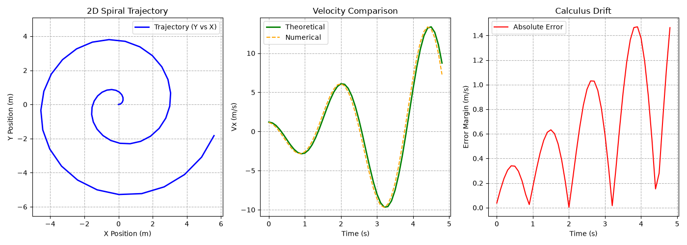

# Kinematics Simulation Solver: Rotating Reference Frames

This project models, solves, and simulates the **kinematic composition of motion** based on reference frame transformations. It uses symbolic derivatives to extract exact calculus equations, evaluates them against discrete numerical data, and visualizes the results on an engineering dashboard.

---

## Kinematics: Reference Frames & Acceleration Composition (Cheat Sheet)

### 1. Reference Frames & Coordinate Setup
* **Absolute Frame ($R$):** Fixed frame centered at $O(x, y, z)$.
* **Relative Frame ($R'$):** Moving/rotating frame centered at $O'(x', y', z')$.

### 2. Motion Equations (Linear + Rotational)
* **Linear Relative Motion:** Moves along the axis at a constant relative speed $V_r$:
$$\mathbf{r}' = \begin{pmatrix} V_r \cdot t \\ 0 \\ 0 \end{pmatrix}$$

* **Rotational Motion:** Uniform rotation around the z-axis with constant angular velocity $\omega$:
$$\theta(t) = \omega \cdot t \implies t = \frac{\theta}{\omega}$$

* **Absolute Position Trajectory:** Combining linear expansion and rotation:
$$\mathbf{r}(t) = \begin{pmatrix} x(t) \\ y(t) \\ z(t) \end{pmatrix} = \begin{pmatrix} V_r \cdot t \cdot \cos(\omega t) \\ V_r \cdot t \cdot \sin(\omega t) \\ 0 \end{pmatrix}$$

---

### 3. Law of Composition of Accelerations
The absolute acceleration $\mathbf{a}_a$ is the sum of three component vectors:
$$\mathbf{a}_a = \mathbf{a}_r + \mathbf{a}_e + \mathbf{a}_c$$

#### 1. Relative Acceleration ($\mathbf{a}_r'$)
* **Definition:** Acceleration measured inside the moving frame $R'$.
* **Value:** $\mathbf{0}$ (since relative velocity $V_r$ is constant: $\frac{d\mathbf{V}_r}{dt} = 0$).

#### 2. Centripetal / Entrainment Acceleration ($\mathbf{a}_e'$)
* **Definition:** Acceleration due to the rotation of the frame itself.
* **Formula:** $\mathbf{a}_e' = \boldsymbol{\Omega} \wedge (\boldsymbol{\Omega} \wedge \mathbf{r}')$
* **Vector Form in $R'$:**
$$\mathbf{a}_e' = \begin{pmatrix} -\omega^2 \cdot V_r \cdot t \\ 0 \\ 0 \end{pmatrix}$$

#### 3. Coriolis Acceleration ($\mathbf{a}_c'$)
* **Definition:** Acceleration resulting from moving within a rotating frame.
* **Formula:** $\mathbf{a}_c' = 2\boldsymbol{\Omega} \wedge \mathbf{V}_r$
* **Vector Form in $R'$:**
$$\mathbf{a}_c' = \begin{pmatrix} 0 \\ 2\omega \cdot V_r \\ 0 \end{pmatrix}$$

---

### 4. Total Acceleration in the Moving Frame ($R'$)
$$\mathbf{a}_a' = \mathbf{a}_c' + \mathbf{a}_e' = \begin{pmatrix} -\omega^2 \cdot V_r \cdot t \\ 2\omega \cdot V_r \\ 0 \end{pmatrix}$$

---

### 5. Frame Transformation: Moving ($R'$) to Absolute ($R$)
To convert the acceleration vector back into the fixed absolute frame $R$, multiply by the standard Rotation Matrix ($R_z$):
$$R_z = \begin{pmatrix} \cos(\omega t) & -\sin(\omega t) & 0 \\ \sin(\omega t) & \cos(\omega t) & 0 \\ 0 & 0 & 1 \end{pmatrix}$$

#### Absolute Acceleration Vector ($\mathbf{a}_a$):
$$\mathbf{a}_a = R_z \times \mathbf{a}_a' = \begin{pmatrix} -2\omega \cdot V_r \cdot \sin(\omega t) - \omega^2 \cdot V_r \cdot t \cdot \cos(\omega t) \\ 2\omega \cdot V_r \cdot \cos(\omega t) - \omega^2 \cdot V_r \cdot t \cdot \sin(\omega t) \\ 0 \end{pmatrix}$$

---

## System Prerequisites & Setup
Ensure your local Python architecture includes the necessary data processing and visualization libraries:
```bash
pip install numpy sympy pandas matplotlib
```

## Dashboard Visualizations Explained

When execution completes, a 3-panel display is rendered:
* **Panel 1 (2D Spiral Trajectory):** Maps spatial coordinates Y vs X. Employs `plt.axis('equal')` to ensure the geometric spiral expands symmetrically without circular distortion.
* **Panel 2 (Velocity Verification):** Overlays precise analytical equations against discrete step approximations to trace tracking convergence.
* **Panel 3 (Calculus Mismatch):** Plots the absolute error curve over time, demonstrating how simulation step drift behaves under continuous rotation.


## Script Operation & Log Output Sample

1. Execute the module using your local terminal shell:
   ```bash
   python kinematics_tracker.py
   ```
2. **Interactive Configuration Prompt Example:**
   ```text
   Enter The Angular Vector Value (omega): 2.5
   Enter The Relative Vector Value (v_r): 1.2
   Enter The Total Time Value (t_max): 5.0
   Enter The Time Step Value (dt): 0.1
   ```
3. **Generated Analysis Ledger Preview:**
   The terminal will output a formatted `Pandas DataFrame` containing the first 10 rows of computational metrics, instantly followed by the live graphical UI rendering window.

   